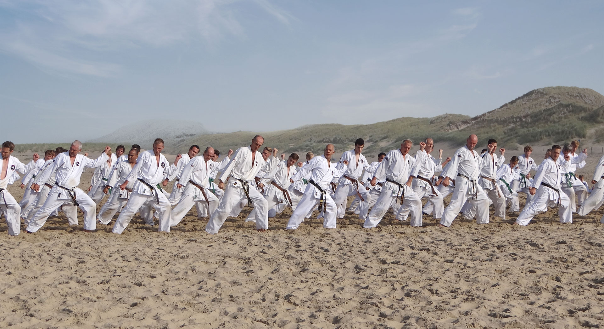

# Karateschool John Smit

> It's a website for our dutch karate school owned by John Smit Sensei, based in Enkhuizen.

## Quick Start

This project is based on 11ty using Stephanie Eckles' [5t3ph/smol-11ty-starter](https://github.com/5t3ph/smol-11ty-starter) template. For local development take the following steps.

1. Clone this repository using `git clone https://github.com/karateschooljohnsmit/karateschooljohnsmit.nl.git`

2. Once cloned, run `npm install` to install 11ty. Then run `npm start` to run 11ty in `serve` mode which will create a local server including hot-reload.

3. Edit `index.md` to change the home page, and then create content within `src/pages` using any templating format you prefer to add content.

> Review the resources available at [11ty Rocks](https://11ty.rocks) to learn how to apply more customizations, including adding custom data sources and reviewing what template languages are available.

### Learn More About Eleventy

- Read up on 11ty in this post by Stephanie on [creating your first Eleventy website](https://11ty.rocks/posts/create-your-first-basic-11ty-website/)

- You may want to swap to [use Sass instead of CSS](https://github.com/5t3ph/11ty-sass-skeleton) and include minifying/autoprefixing (you can copy the relevant bits from the config and the package scripts/dependencies)
- Review [additional common config customizations](https://11ty.rocks/eleventyjs/)
- Check out some [quick tips](https://11ty.rocks/tips/) to learn more about using Eleventy's features
- Add automatically generated [social images with my plugin](https://www.npmjs.com/package/@11tyrocks/eleventy-plugin-social-images)
