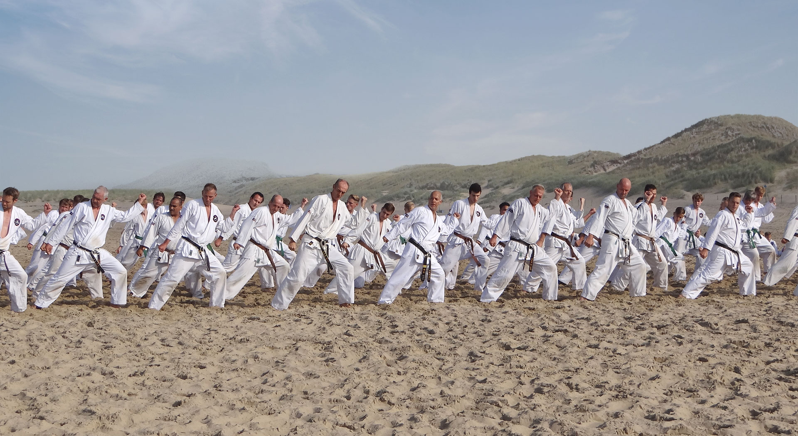

## Umi Ryu Karate is goed voor lichaam en geest

Karate is een effectieve vechtsport. Door beoefening van karate kunnen eigenschappen als doorzettingsvermogen en zelfbeheersing ontwikkeld worden. Het vormt je karakter en je wordt zelfverzekerder, fitter en energieker. De trainingen versterken je lichaam en geest. Volwassenen en jeugd kunnen op elk moment instappen en zullen al snel in staat zijn zichzelf beter te verdedigen. Kom eens langs voor een gratis proefles!

Door beoefening van karate wordt je zelfverzekerder, fitter en energieker, kortom iemand die karate beoefent zit niet alleen strakker, maar ook beter in zijn vel (lichaam en geest zijn in balans).

> In de loop van de tijd heeft het karate een aantal belangrijke ontwikkelingen doorgemaakt, die de beoefenaar kunnen helpen om boven zichzelf uit te stijgen. Door fysieke en mentale groei, zelfvertrouwen en zelfdiscipline, nemen en geven, wordt transformatie mogelijk. <cite>John Smit Sensei</cite>
