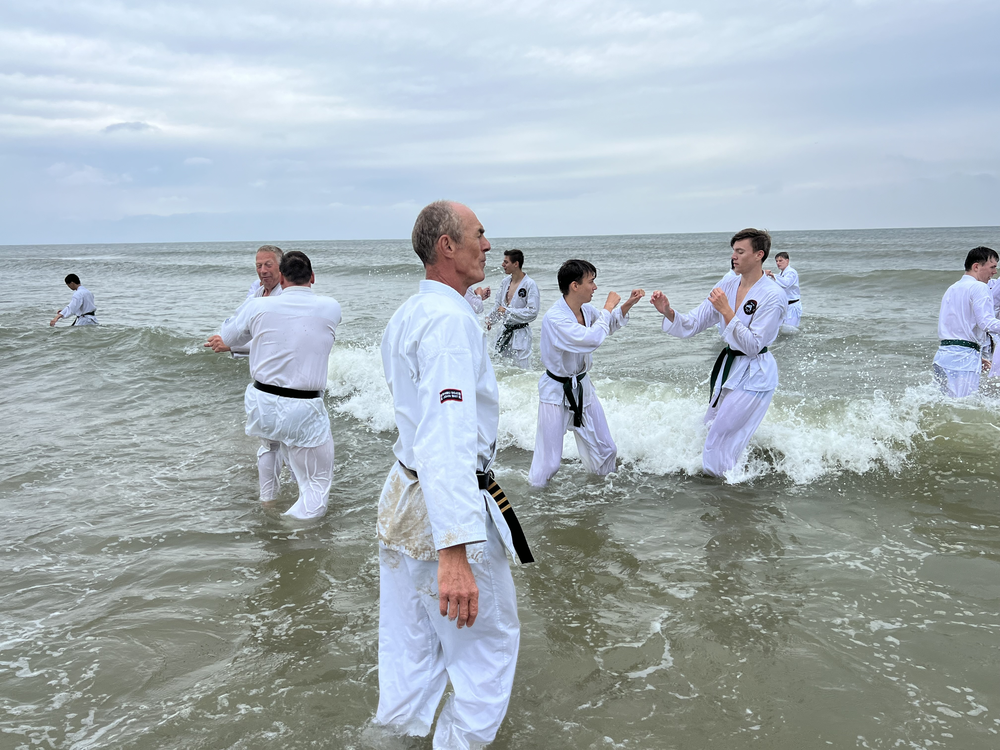

## Trainingslocaties

Op maandag trainen we in gymzaal [de Wiekslag](https://goo.gl/maps/PvfAakHLZLiTecWdA) aan de Kievitstraat 54 te Enkhuizen. De lestijden zijn als volgt:

- Jeugd 6-8 jaar: 16.00 - 17.00
- Jeugd 8-11 jaar: 17.00 - 18.00
- Jeugd 11-15 jaar: 18.30 - 19.30
- Volwassenen: 19.30 - 20.45

N.B.: Tijdens [schoolvakanties](https://www.rijksoverheid.nl/onderwerpen/schoolvakanties/overzicht-schoolvakanties-per-schooljaar/overzicht-schoolvakanties-2023-2024) is er geen training.

## John Smit Sensei

John Smit is sinds 1978 leerling van Ernst van der Zee Shihan. In het jaar 2000 heeft John alle _Shodan_ (zwarte band) examens met goed gevolg doorlopen waarna hij, na het volgen van vele speciale trainingen, in 2007 slaagde voor 2e dan, in 2014 voor de 3e dan en in 2023 hoopt te slagen voor de 4e dan.

Sinds 2005 is hij zijn eigen _Shibu Dojo_ begonnen waar hij met veel passie karateles geeft aan 3 leeftijdsgroepen jeugd en een groep volwassen.

John is daarnaast Rots en water coach en bevoegd om training op scholen aan te bieden. De Rots en water training is bedoeld om kinderen en volwassenen te laten groeien in zelfverzekerdheid, voor zichzelf te leren opkomen en te leren hun grenzen aan te geven. Deze vaardigheden zijn verwerkt in de karatelessen.

> In onze dojo hangt een inclusieve sfeer waar iedereen welkom is om onze training, waarbij lichaam en geest in balans staan, zelf te ervaren. <cite>John Smit Sensei</cite>

## Dirk-Jan Post Sempai

Dirk Jan Post is sinds 2007 leerling van John Smit Sensei en Ernst van der Zee Shihan. In het jaar 2018 slaagde hij voor _Shodan_ en is nu volop aan het trainen voor zijn 2e dan examen waar hij in 2023 voor hoopt te slagen.

> Karate is voor mij meer is dan alleen sport. Het is een manier van leven, van nooit op geven, het hoofd geheven. Zelfverzekerd treed je de wereld tegemoet zonder de behoefte jezelf te bewijzen. <cite>Dirk-Jan Post Sempai</cite>
