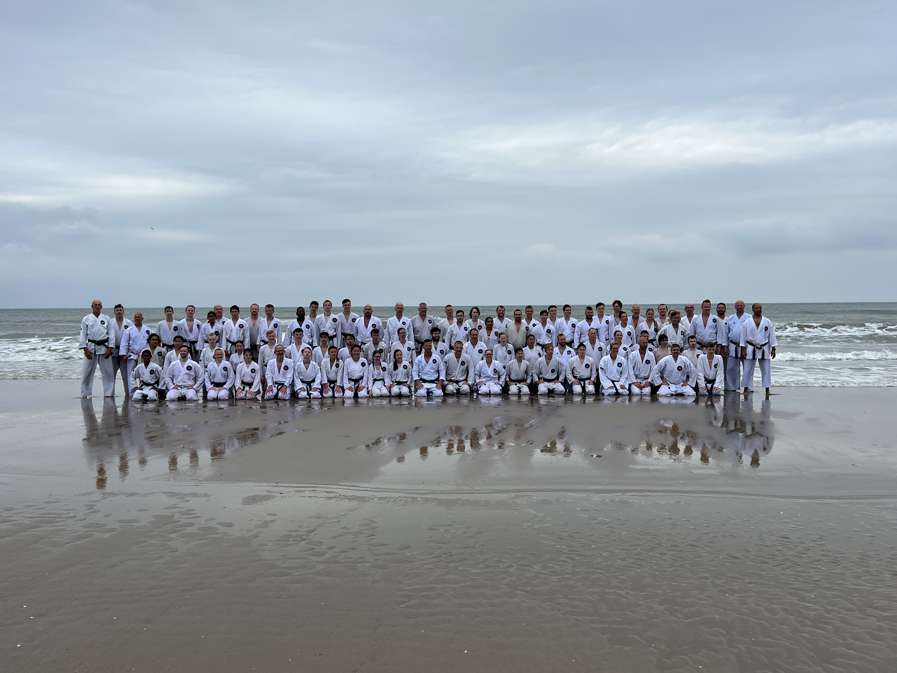
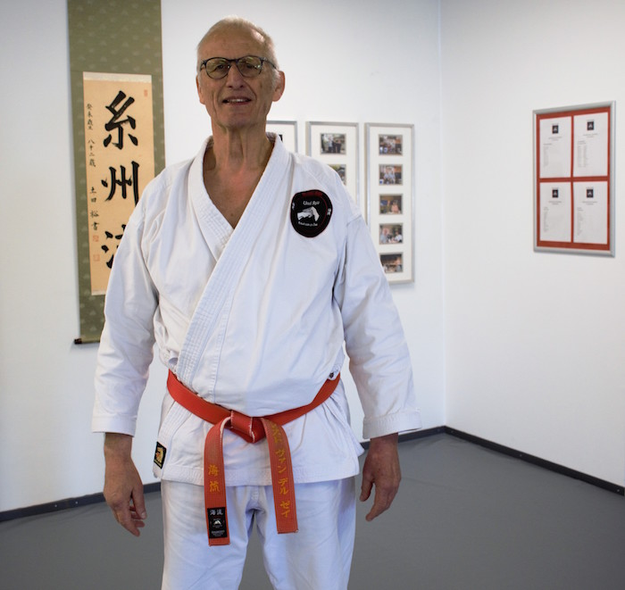

## Over Umi Ryu

[Umi Ryu Karatedo](https://umiryu.nl/) is een karatestijl waarin verschillende vechtsporten zijn gecombineerd. Je herkent er Kyokushinkai en Itosu Ryu karate in, maar ook Jiu-Jitsu en verschillende soorten zwaard- en stokvechten: Iaido, Jodo, Bo-Jitsu, Hanbo-Jitsu, Tanjo-Jitsu, Keebo-Jitsu.

Karate is een effectieve vechtkunst en is gericht op het trainen van de geest en het versterken van het lichaam. Er wordt aandacht besteed aan de ontwikkeling van:

- Karakter
- Eerlijkheid
- Doorzettingsvermogen
- Zelfbeheersing
- Etiquette

Het uiteindelijke doel van karate is om een beter mens te worden. Dat bereik je door hard te trainen.

> Scherp je zintuigen, wordt bewuster… leer de technieken die je leven kunnen redden! <cite>Ernst van der Zee Shihan</cite>

Door fysieke training versterkt het lichaam. Je ontwikkelt betere reflexen, balans, coördinatie en prestaties in alle fysieke activiteiten. Je ervaart meer kracht, uithoudingsvermogen en lenigheid en blijft door intensieve kracht en cardiotraining gemakkelijker op gewicht.

Door mentale training verbetert uw concentratievermogen in het dagelijks leven. Je ervaart minder stress en ontwikkelt een beter vermogen om te ontspannen. Door training krijgt u een positieve houding tegenover het leven door zelfvertrouwen en zelfdiscipline. Dit leidt tot eigenwaarde, een positieve visie op het leven en respect voor de mensen om u heen.

## Ernst van der Zee Shihan

[Umi Ryu Karatedo](https://umiryu.nl/) is vernoemd naar Ernst van der Zee Shihan, Umi Ryu is Japans voor _Zee School_. Ernst van der Zee Shihan is al sinds 1965 actief in Budo (krijgskunsten). Zijn training begon met [Kyokushinkai Karate](https://ibk-kyokushin.nl/) bij [Martin Gravestijn Shihan](https://www.smr-jodo.nl/m-g-gravestijn/) en hij trainde gelijktijdig bij [John Bluming Shihan](https://www.jonbluming.nl/). In 1968 startte hij met [Itosu Ryu Karatedo](https://itosuryu.nl/), [Shindo Muso Ryu Jodo](https://www.smr-jodo.nl/) en Iaido. Daarmee staat Ernst van der Zee Shihan midden in de ontwikkeling van de traditionele Japanse krijgskunst in Nederland.

Ernst van der Zee Shihan verdiepte zich gedurende zijn carrrière in verschillende andere systemen om verwantschappen en raakvlakken te doorgronden. Zo verdiepte hij zich in onder andere: [Goju Ryu](https://www.iogkf.nl/goju-ryu/), [Pencak Silat](https://npsf.nl/), [Hapkido](https://www.hapkidobond.nl/), [Tai Chi Chuan](https://www.itcca.nl/), [Wadokai](https://wadokai.nl/) en [Shotokan](https://platformshotokannederland.nl/). Bepaalde elementen uit deze vechtkunsten zijn te herkennen in Umi Ryu Karatedo.

> Karate vormt je karakter. <cite>Ernst van der Zee Shihan</cite>

Ernst van der Zee Shihan heeft een indrukwekkende loopbaan in de Budo. Hij gaf 25 jaar training aan de politie en heeft ruim 3 jaar gewerkt voor het opleidingscentrum Mobiele Eenheden. Tijdens zijn loopbaan maakte hij kennis met diverse grote Japanse leermeesters. Vanaf 1984 bezoekt hij met regelmaat zijn leermeesters in Japan.

De [Umi Ryu Honbu Dojo](https://umiryu.nl/) in Grootebroek, waar Shihan nog steeds les geeft, bestaat sinds 1977. Inmiddels is Umi Ryu Karatedo uitgegroeid tot een school met vele leden en zijn er naast de Honbu Dojo zes Shibu Dojo's waaronder Karateschool John Smit.
